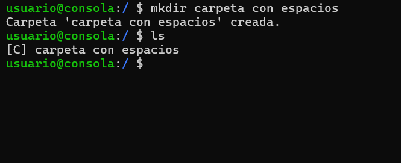
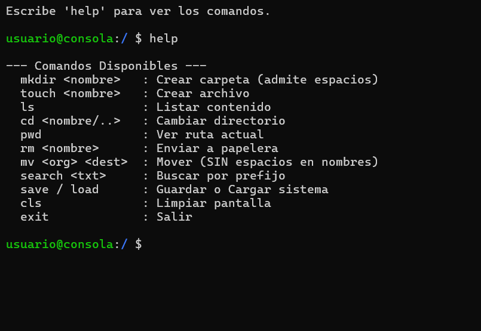
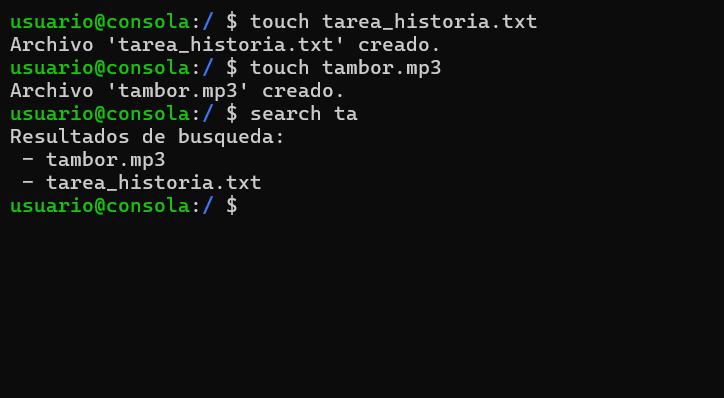
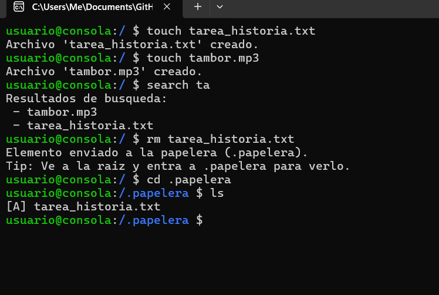

# Simulador de FileSystem en C++

**Materia:** Estructura de Datos  
**Integrantes:**
- Juan Pablo Flores Soto
- Carlos Daniel Delgado Villareal

---

## 1. Descripción del Proyecto
Este proyecto consiste en un simulador de consola de comandos (estilo Linux/Bash) desarrollado en C++. 
El sistema gestiona una jerarquía de archivos y directorios utilizando estructuras de datos avanzadas para garantizar eficiencia y persistencia.

### Tecnologías y Estructuras Utilizadas:
- **Árbol N-ario:** Para la estructura jerárquica de carpetas y archivos.
- **Trie (Árbol de Prefijos):** Para el motor de búsqueda y autocompletado instantáneo.
- **JSON (nlohmann/json):** Para la persistencia de datos (Guardar/Cargar).
- **Pilas/Colas:** Implícitas en la recursividad de las operaciones.

---

## 2. Instrucciones de Compilación y Ejecución

### Requisitos
- Compilador de C++ compatible con el estándar C++11 o superior.
- Librería `json.hpp` (incluida en el proyecto).

### Pasos en Code::Blocks
1. Abrir el archivo del proyecto `.cbp` o el `main.cpp`.
2. Ir a **Settings** -> **Compiler**.
3. Compilar y Correr (Build and Run).

---

## 3. Manual de Comandos

### Gestión de Archivos y Directorios
| Comando | Descripción | Ejemplo |
|:---|:---|:---|
| `mkdir <nombre>` | Crea una nueva carpeta. Admite espacios. | `mkdir Tarea de Mate` |
| `touch <nombre>` | Crea un nuevo archivo. Admite espacios. | `touch notas.txt` |
| `rm <nombre>` | Envía un archivo o carpeta a la **Papelera de Reciclaje**. | `rm archivo_viejo` |
| `mv <origen> <destino>` | Mueve un elemento a otra ruta. **(No admite espacios)**. | `mv notas.txt carpeta_final` |

**Soporte de Nombres con Espacios:**

### Navegación
| Comando | Descripción | Ejemplo |
|:---|:---|:---|
| `ls` | Lista el contenido del directorio actual (Carpetas [D] y Archivos [F]). | `ls` |
| `cd <nombre>` | Entra a una carpeta. Usa `..` para regresar. | `cd ..` o `cd musica` |
| `pwd` | Muestra la ruta absoluta actual en el sistema. | `pwd` |

**Vista de la Interfaz y Menú de Ayuda:**

### Búsqueda Avanzada (Trie)
| Comando | Descripción | Ejemplo |
|:---|:---|:---|
| `search <prefijo>` | Busca instantáneamente cualquier archivo/carpeta que empiece con el texto indicado. | `search ta` (encuentra 'tarea', 'tambor') |

**Demostración del Buscador Inteligente:**

### Persistencia (JSON)
| Comando | Descripción |
|:---|:---|
| `save` | Guarda el estado actual del árbol en `sistema.json`. |
| `load` | Carga el estado desde el archivo, restaurando la sesión anterior. |

### Sistema y Utilidades
| Comando | Descripción |
|:---|:---|
| `cls` | Limpia la pantalla de la consola. |
| `help` | Muestra la lista de comandos disponibles. |
| `exit` | Cierra el programa de forma segura. |

---

## 4. Características Especiales

### Sistema de Papelera de Reciclaje
El comando `rm` no elimina los archivos permanentemente de inmediato.
1. Los mueve a una carpeta oculta `.papelera` ubicada en la raíz.
2. Para recuperar un archivo, el usuario puede entrar (`cd .papelera`) y moverlo (`mv`).
3. Para eliminarlo definitivamente, se debe ejecutar `rm` dentro de la papelera.

**Prueba de Funcionamiento de la Papelera:**

### Validaciones de Seguridad (Robustez)
- **Prevención de Ciclos:** El sistema impide mover una carpeta dentro de sí misma o de sus subcarpetas, evitando bucles infinitos en el árbol.
- **Manejo de Errores:** Mensajes claros cuando no se encuentran archivos o rutas.

---

## 5. Reporte de Pruebas (QA) y Rendimiento

**Pruebas de Integración:**
- [x] **Persistencia:** Se verificó el ciclo completo `Crear -> Guardar -> Borrar Memoria -> Cargar`. El sistema restaura correctamente la jerarquía.
- [x] **Sincronización Trie:** Se comprobó que al borrar un archivo con `rm`, este desaparece correctamente de los resultados de búsqueda (`search`).
- [x] **Papelera:** Los archivos persisten en `.papelera` hasta su eliminación manual.

**Pruebas de Estrés (Performance):**
- Se realizó una inserción masiva de **1,000 nodos** simultáneos.
- **Resultados:**
  - Tiempo de respuesta de `ls`: Inmediato.
  - Tiempo de respuesta de `search`: Inmediato (gracias a la indexación del Trie).
  - Estabilidad del JSON: Correcta escritura y lectura de archivos de gran tamaño.

---

## 6. Limitaciones Conocidas
1. **Espacios en el comando `mv`:** Debido a la ambigüedad en la lectura de argumentos, el comando mover no soporta nombres con espacios (ej: `mv mi archivo destino` fallará). Se recomienda usar guiones bajos o nombres simples para esta operación.
2. **Restaurar automático:** No existe un comando `restore`. La recuperación de archivos de la papelera debe hacerse manualmente con `mv`.